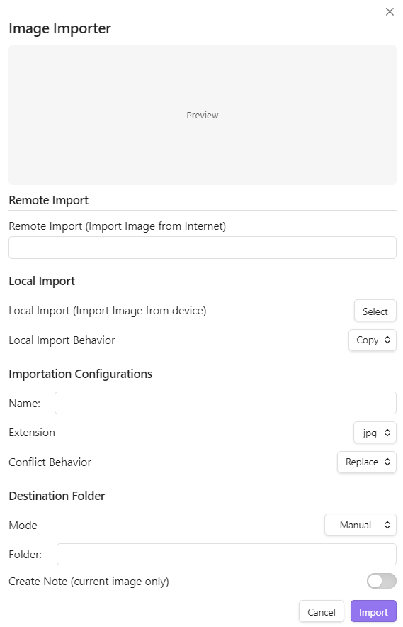
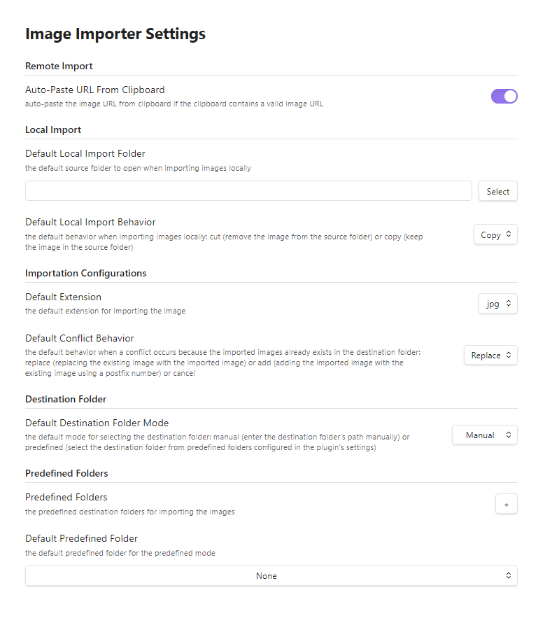

# image-importer
An Obsidian plugin for importing images into the vault either from the device (local) or from the web (remote) with an option to create an accompanying markdown file for the imported image.

## Features
- Importing images into the vault from the device (local) or from the web (remote) with configurations through the plugin's modal.
- Controlling the defaults for the configurations through the plugin's settings
- Creating accompanying markdow file for the imported image with a custom name (Optional)

Modal:

  

Settings:

  

## Installation
1. Open **Obsidian** app and go to **Settings → Community Plugins → Browse** (Note: enable community plugins if not enablled)
2. Search for `Image Importer`
3. Install and Enable

## Usage
1. Configure the hotkey to open the plugin's modal through going to **Settings → Hotkeys** and searching for `Image Importer: Open Image Importer`
2. Open the plugin's modal with the hotkey to import images after settings the configurations
3. Open the plugin's settings to set the defaults for the configurations

### Configurations
- Remote Import: importing an image from the web through specifying its URL - Auto-Paste URL from Clipboard is an option that can be turned on/off through the plugin's settings for whether to auto-paste the url in the clipboard if it is a valid image url into the image url input field in the modal.
- Local Import: importing an image from device through selecting and image and the behavior (cut → remove the image from the source folder after importing or copy → keep the image in the source folder after importing) - the default folder to open to select the image and the default behavior can be configured through the plugin's settings.
- Importation Configurations: specifying the image name and extension alongside with the conflict behavior if an image with the same name as the imported image already exists in the destination folder (replace → replace the existing image with the imported image or add → adding the imported image to the existing image using a postfix number in the name or cancel) - the default extension and confilct behavior can be configured through the plugin's settings.
- Destination Folder: specifying the destination folder either by specifying the path (mode: manual) or selecting from predefined folders (mode: predefined) and selecting whether to create accompanying markdown file - the default mode and the predefined folders and the default predefined folder can be configured through the plugin's settings.

## Compatibility:
the plugin is compatible with **Templater** plugin as the created accompanying markdown files follows their assigned template. 

## Notes:
the plugin - combined with **Templater** plugin - can be used with **Obsidian**'s **Bases** plugin to instantly create bases' entries through importing images.

## Changelog
- 1.0.0: Initial Release

## License
- MIT
